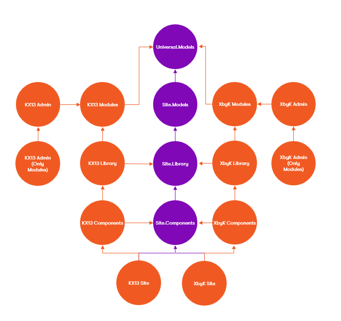

# Modules and Structure

## Plug and Play Modules

The Baseline was designed in a 'plug and play' mindset, featuring a Core module along with Feature modules.  While the Core is required, the rest you can pick and choose based on your site's needs.  Below is an overview of the Modules, and each module will have additional documentation around the Features, Models, Interfaces, and Customization Points.

## Modules

- **Core**: Contains Core Systems, including Object, Page/Content Item, User, Media, Category, Localization and Page Meta Data systems.
- **Navigation**: Contains systems for Main Navigation, Secondary Navigations, Breadcrumb, and Sitemap handling.
- **Account**: Contains systems for Site Member (Registration, Log In via Forms or Oath, Password Reset, 2-Factor Authentication, etc)
- **Localization**: Contains additional helpers for Localized Categories
- **Search**: Site Search Implementation (Lucene for both Kentico Xperience 13 and Xperience by Kentico).
- **TabbedPages**: Systems to allow you to use Kentico's Page Builder to load other page's content within another page's rendering, often associated with a Tabbed Page
- **Ecommerce**: Contains Ecommerce hookups.  Currently only for Kentico Xperience 13 until Xperience by Kentico gains Ecommerce support.

## Architecture of Modules
Each Module contains (roughly) the following libraries, which are each separate packages (`XperienceCommunity.Baseline.LIBRARYNAME`)

**NOTE**: Obviously, the Core module won't have the additional Core.____ reference, as itself is the Core Module.  All other modules though reference the Core.

**Kentico Agnostic Libraries**

These are the libraries shared between the Kentico Xperience 13 and Xperience by Kentico libraries, and have no references to Kentico itself.

- **____.Models**
  -  Contains Models and Interfaces
  - References:
    - Core.Models
- **____.Library**
  - Contains any Kentico Agnostic Implementations, Code, Extensions, etc.
  - References:
    - Core.Library
    - ____.Models
- **____.RCL**
  - Contains any Kentico Agnostic Tag Helpers, View Components, or related .Net Core MVC Items
  - References:
    - Core.RCL
    - ____.Library

**Kentico Specific Libraries**

Along with the above, there will be Libraries which are Kentico Specific

- **____.XperienceModels.[KX13|Xperience]**
  - Contains the Generated code files for the types used to implement the main Module
  - References:
    - Core.XperienceModels.[KX13|Xperience]
    - ____.XperienceModels.[KX13|Xperience]
- **____.Library.[KX13|Xperience]**
  - Contains the Implementation of the generic interfaces found in the ____.Models project
  - Also can contain Kentico Version Specific helper interfaces and systems
  - References:
    - Core.Library.[KX13|Xperience]
    - ____.Models
    - ____.Library
    - ____.XperienceModels.[KX13|Xperience]
- **____.RCL.[KX13|Xperience]**
  - Contains Tag Helpers, View Components, or related .Net Core MVC Items, as well as DI extension methods for installation
  - References:
    - Core.RCL
    - ____.RCL
    - ____.Library.[KX13|Xperience]    
- **____.Admin.Xperience**
  - For Xperience only, this contains any Admin customizations
  - References:
    - Core.Library.Xperience
    - ____.Library.Xperience and 

## Starting Site Architecture

The Baseline also comes with a Starting Site that follows a similar structure.  Keep in mind that the amount of separation of concerns that mimics the Baseline structure is more important to Kentico Xperience 13 (so you can keep as much Kentico Agnostic for the upgrade) than necessarily for Xperience by Knentico.  However, it is still roughly easier to do test and such using Kentico Agnostic items (although Xperience's Model system is designed to be easy to fake and test).

*In the image above, The arrows show what they reference, not what references them.*

- **Site.UniversalModels**
  - Models, packages, and extension methods shared between both your MVC Site and Admin
  - Was more important in Kentico Xperience 13 due to .net 2.0 requirement to share models between Site (.net Core) and Admin (.net 4.8)
  - Should be Kentico Agnostic
  - No references
- **Site.Models**
  - Kentico Agnostic Models and Interfaces used in your Site
  - The site version of the `____.Models` libraries
    - References
      - Core.Models
      - ____.Models (any number of the features)
      - Site.UniversalModels
- **Site.Library**
  - Kentico Agnostic Implementations, Extension methods, etc.
  - The site version of the `____.Library` libraries
  - References
    - Core.Library
    - ____.Library (any number of features)
    - Site.Models
- **Site.Components**
  - Kentico Agnostic Components (View Components, Tag Helpers, Etc)
  - The site version of the `____.RCL` libraries
    - References
      - Core.RCL
      - ____.RCL (any number of the features)
      - Site.Library
- **XperienceModels**
  - Your Kentico generated models
  - The site version of the `____.XperienceModels.[KX13|Xperience]` libraries
  - References
    - Core.XperienceModels.[KX13|Xperience]
    - ____.XperienceModels.[KX13|Xperience]
    - Site.UniversalModels
- **XperienceAdmin** (Xperience by Kentico Only)
  - Admin Customizations
  - The site version of the `____.Admin.Xperience`
  - References
    - Core.Admin.Xperience
    - ____.Admin.Xperience
    - XperienceModels (KX13 or XbyK) OR Site.Library.Xperience (XbyK only - If you wish to have more shared libraries)
- **MVC**
  - The main project, since `IServiceCollection` and Middleware hookups are here
  - The site version of the` ____.RCL.[KX13|Xperience]` libraries
  - Features, Page Templates, Implementation code, etc can all go here if you wish.
    - References
      - Core.RCL.[KX13|Xperience]
      - ____.RCL.[KX13|Xperience] (any number of the features)
      - Site.Components
      - XperienceModels
      - XperienceAdmin (Xperience by Kentico Only)
    
Feel free to structure things however you wish for the site, as long as the main project **MVC** references the `Core.RCL.[KX13|Xperience]` and any of the `____.RCL.[KX13|Xperience]` packages, you will be set.
